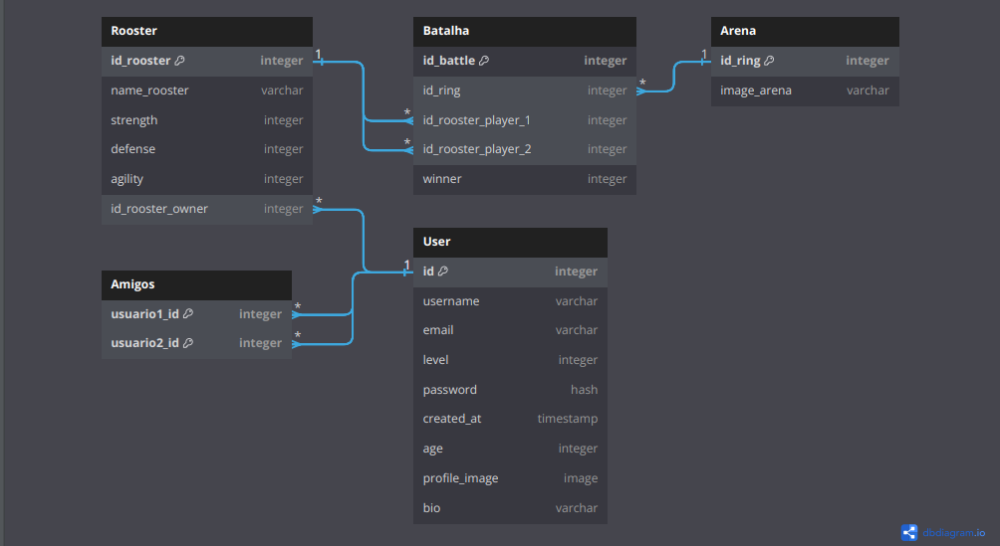

# Rinha de Galo 🐔

Esse repositorio irá conter a parte do back-end e o estudo do aplicativo Rinha de galo, ele está dividido em dois, sendo esse o back-end, o front-end está no repositorio (https://github.com/Luan16p/rinha-de-galo-front), lá discutimos tecnicas de design para implementar no App, aqui será discutida a parte tecnica, envolvendo banco de dados, autenticação, segurança e infraestrutura.

## Por que Laravel?

Escolhi laravel para ser a base do Site, pois é uma ferramenta extremamente facil e maleavel, sendo muito pratica caso alguem tenha interesse em contribuir com o projeto futuramente, alem disso seus indicadores de benchmark provam que ele é extremamente performatico, e possui varias subrotinas que ajudam muito o desenvolvimento.

## O que será necessario para funcionar na minha maquina?

Para o servidor funcionar em ambiente local, você precisará dessas coisas:

- Servidor Apache ou apenas baixar um app qualquer tipo Xampp ou Laragon
- Oracle MySQL, o Banco de dados será feito com essa tecnologia, eu recomendo o Workbench, facil de usar e não dá dor de cabeça, mas tem outros como DBeaver ou o proprio Laragon anteriormente mencionado

## O que será necessario configurar?

Para funcionar, você precisará configurar o `.env` de seu projeto, use o [.ENV.EXAMPLE](./.env.example) como base, em especial, precisará alterar essas linhas:

```
DB_CONNECTION=mysql
DB_HOST=127.0.0.1
DB_PORT=3306
DB_DATABASE=laravel
DB_USERNAME=root
DB_PASSWORD=
```

Para o endereço, nome e senha que você escolheu, assim o servidor está quase configurado para rodar.

_Se voce caiu de paraquedas no mundo do laravel, recomendo ler_ https://www.treinaweb.com.br/blog/configurando-o-ambiente-de-desenvolvimento-php-laravel-no-windows _para entender o que será feito aqui._

## Banco de dados

O projeto central seguirá esse design de tabelas (é importante lembrar que isso poderá, e com certeza será alterado futuramente, e que falhas irão ocorrer, então se achar alguma, me mande um e-mail: luan.silva8@estudante.ifms.edu.br)



